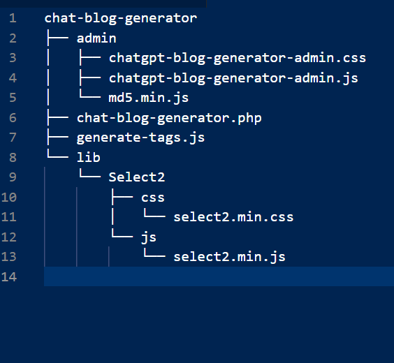

# Tree Exporter

Tree Exporter is a Visual Studio Code extension that exports the directory structure of your project as a text-based tree. It's a great utility for generating visual trees of files and folders, making it easy to share or document your project's structure.

## Features

The Tree Exporter extension allows you to:

- Export the directory structure of your project as a text-based tree.
- Generate visual trees of files and folders for easy sharing or documentation.
- Run the command from the command palette or the explorer context menu.

## Usage

1. Open a folder in Visual Studio Code.
2. Press `Ctrl+Shift+P` (or `Cmd+Shift+P` on macOS) to open the command palette.
3. Search for "Tree Exporter: Export" and run the command.
4. A new text document containing the directory structure will open.

Alternatively, you can right-click on a folder in the VS Code explorer and select "Export Tree" from the context menu.

[License](LICENSE.md)

## Requirements

There are no specific requirements or dependencies for this extension.

## Known Issues

There are no known issues at this time.

## Release Notes

### 1.0.0

Initial release of Tree Exporter.

**Enjoy!**